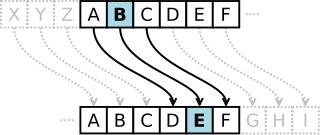
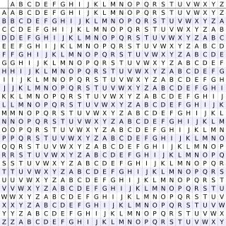

# Cifra de substituição

## Cifra de César

Um modelo classico e bem básico da criptografia, utilizado por César para comunicação secreta com alguns generais. Essa criptografia é bem fraca e facilmente descriptografada com um ataque de força bruta.

Consiste em "rotacionar" o alfabeto, atribuindo a cada letra do alfabeto o valor da letra n casas a sua frente. Desse modo a única "chave" que precisamos é quantas casas o usuário desejou pular, nosso n.

O modelo pode ser descrito matematicamente pela fórmula: En(x) = (x + n)

Porém é bem fácil quebrar isso como pode imaginar, com apenas 26 letras no alfabeto é simples descobrir a string original.

Apesar disso, na minha implementação, eu criei um alfabeto composto por letras minusculas, maiusculas, números e alguns caracteres especiais, o que dificulta bastante a quebra, já que só meu sistema possui o alfabeto original.

## Cifra de Vigenère

A cifra recebe esse nome, mas não foi realmente criada por Vigenère e sim por Giovan Batista Belaso.

Esse método utiliza uma série de Cifras de César baseadas em letras de uma chave.

Basicamente você cria 26 linhas com todas as variações da cifra de césar, depois adiciona ao seu topo e lateral o alfabeto novamente, para utilizar como base para criptografar. Assim você cria uma grade de Vigenère (Também conhecida como tabula recta).

Após isso escolhe uma chave, como por exemplo "limao". E escolhe a mensagem, como por exemplo "ATACARBASESUL". Vamos então repetir todas as letras da chave até alcançar o comprimento da mensagem: "LIMAOLIMAOLIM".

Então pra cada letra, olharemos a linha da letra da chave e a coluna da letra da mensagem. Ou seja, linha L, coluna A, temos L. Assim por diante, Lina I, coluna T, temos B. A mensagem ficará: "LBMCOCJMSSDCX".

Podemos descrever matematicamente como:
Ci = Pi + Ki
E para descriptografar:
Pi = Ci - Ki + 26

Apesar de parecer ser um método bem seguro, e perdurou por mais de 300 anos sendo, Charles Babbage descobriu que, sendo a chave curta e constantemente repetida para o método, então surgem padrões que podem ser usados para descobrir a chave.

Com ferramentas como o Kasiski examination ou a análise de frequência, podemos identificar a exxtensão da chave e, eventualmente, deduzir a própria chave.

A nível de exemplo, imagine:

Texto Original: DEDEDEDEDE
Chave (repetida): KEYKEYKEYK

Criptografando:

Texto Original	D	E	D	E	D	E	D	E	D	E
Chave	        K	E	Y	K	E	Y	K	E	Y	K
Criptografado	N	I	B	O	F	I	N	I	B	O

Forma-se um padrão NIBOFI NIBOFI.

## Cifra de Autochave
https://pt.wikipedia.org/wiki/Cifra_de_autochave

